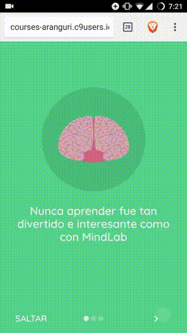

# Mindlab
Mindlab is a mobile platform that makes learning a fun and efficient experience. We developed a format that enables learning to take place anywhere, anytime.

We offer bite-sized lessons that makes learning easier by requiring less concentration time, and after each lesson we consolidate acquired knowledge by testing new concepts with interactive quizzes.

Available courses are: Personal Development, Nutrition, and Introduction to Programming.

## Demo


## Deployment instructions

- ```npm install -g mup```
- ```cd .deploy```
- ```mup deploy```
